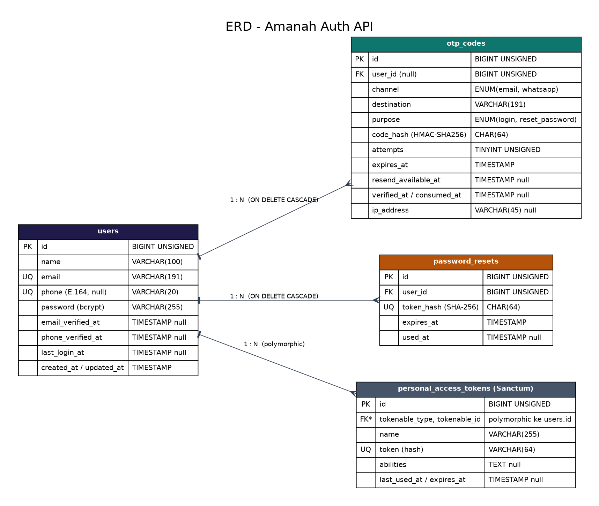
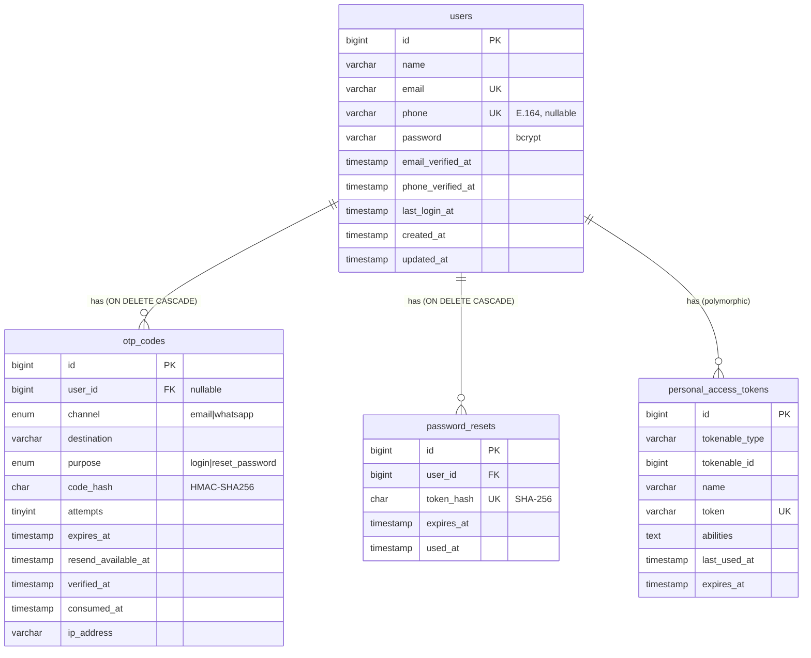
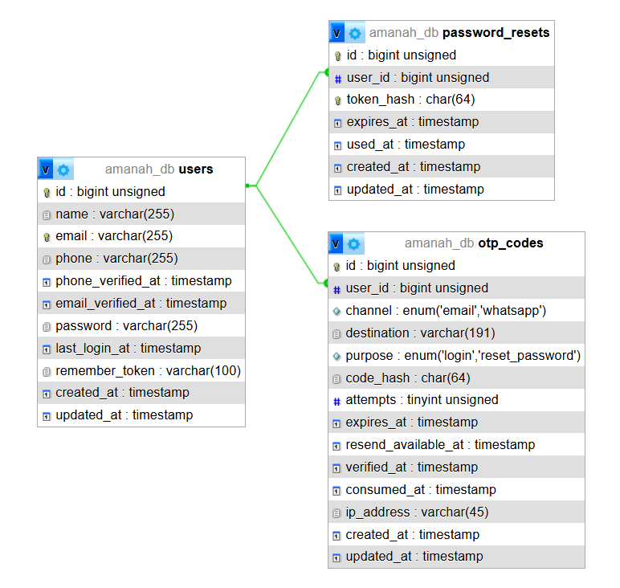

# Dokumen Database - Amanah Auth API

DBMS: **MySQL 8 / PostgreSQL 14+** (dibuat lewat migration Laravel, jadi portabel).
Engine MySQL: InnoDB, charset `utf8mb4`.

## 1. ERD

## 2. Struktur Tabel

### 2.1 `users`
Data akun. Dipakai oleh Register, Login Email, Login WhatsApp, dan Lupa Password.

| Kolom | Tipe | Null | Keterangan |
|---|---|---|---|
| id | BIGINT UNSIGNED, AI | NO | Primary key |
| name | VARCHAR(100) | NO | Nama lengkap (sesuai KTP) |
| email | VARCHAR(191) | NO | Unik, disimpan huruf kecil |
| phone | VARCHAR(20) | YES | Unik, format E.164 (`+6281234567890`) |
| password | VARCHAR(255) | NO | Hash bcrypt, **tidak pernah plain text** |
| email_verified_at | TIMESTAMP | YES | Terisi saat OTP email berhasil diverifikasi |
| phone_verified_at | TIMESTAMP | YES | Terisi saat OTP WhatsApp berhasil diverifikasi |
| last_login_at | TIMESTAMP | YES | Login sukses terakhir |
| created_at, updated_at | TIMESTAMP | YES | Timestamp Laravel |

### 2.2 `otp_codes`
Semua OTP (login WhatsApp & lupa password), baik via email maupun WhatsApp.

| Kolom | Tipe | Null | Keterangan |
|---|---|---|---|
| id | BIGINT UNSIGNED, AI | NO | PK |
| user_id | BIGINT UNSIGNED | YES | FK ke `users.id` |
| channel | ENUM('email','whatsapp') | NO | Kanal pengiriman |
| destination | VARCHAR(191) | NO | Email / nomor WA tujuan |
| purpose | ENUM('login','reset_password') | NO | Tujuan OTP (OTP login tidak bisa dipakai untuk reset) |
| code_hash | CHAR(64) | NO | HMAC-SHA256(kode + tujuan + purpose); kode asli tidak disimpan |
| attempts | TINYINT UNSIGNED | NO | Jumlah percobaan verifikasi (default 0, maks 5) |
| expires_at | TIMESTAMP | NO | Kedaluwarsa (default 5 menit) |
| resend_available_at | TIMESTAMP | YES | Cooldown kirim ulang (60 dtk) / masa lockout (15 mnt) |
| verified_at | TIMESTAMP | YES | Waktu OTP diverifikasi benar |
| consumed_at | TIMESTAMP | YES | Terisi = OTP sudah dipakai / digantikan OTP baru |
| ip_address | VARCHAR(45) | YES | IP peminta (audit, IPv4/IPv6) |

### 2.3 `password_resets`
Token sementara hasil verifikasi OTP lupa password (dipakai di layar "Atur Kata Sandi Baru").

| Kolom | Tipe | Null | Keterangan |
|---|---|---|---|
| id | BIGINT UNSIGNED, AI | NO | PK |
| user_id | BIGINT UNSIGNED | NO | FK ke `users.id` |
| token_hash | CHAR(64) | NO | SHA-256 dari `reset_token` (token asli hanya dikirim ke client sekali) |
| expires_at | TIMESTAMP | NO | Berlaku 15 menit |
| used_at | TIMESTAMP | YES | Terisi saat token dipakai (sekali pakai) |

### 2.4 `personal_access_tokens`
Tabel standar Laravel Sanctum untuk Bearer token. Token disimpan sebagai hash SHA-256.
Setiap token punya `expires_at` (24 jam, atau 30 hari bila `remember_me`).

## 3. Relasi

| Relasi | Kardinalitas | Aksi saat induk dihapus |
|---|---|---|
| users -> otp_codes (`user_id`) | 1 : N | CASCADE |
| users -> password_resets (`user_id`) | 1 : N | CASCADE |
| users -> personal_access_tokens (`tokenable_*`) | 1 : N (polymorphic) | dihapus oleh aplikasi |

## 4. Constraint & Index

| Tabel | Jenis | Kolom | Tujuan |
|---|---|---|---|
| users | PRIMARY KEY | id | |
| users | UNIQUE | email | Mencegah email ganda ("Email ini sudah terdaftar") |
| users | UNIQUE | phone | Mencegah nomor WA ganda ("Nomor WhatsApp sudah terdaftar"). NULL boleh berulang |
| otp_codes | PRIMARY KEY | id | |
| otp_codes | FOREIGN KEY | user_id -> users.id (CASCADE) | Integritas data (+ index otomatis) |
| otp_codes | INDEX `otp_lookup_idx` | (destination, purpose, id) | Mencari OTP terbaru per tujuan dengan cepat |
| otp_codes | INDEX | expires_at | Memudahkan pembersihan OTP kedaluwarsa |
| otp_codes | ENUM | channel, purpose | Membatasi nilai yang valid |
| password_resets | PRIMARY KEY | id | |
| password_resets | FOREIGN KEY | user_id -> users.id (CASCADE) | |
| password_resets | UNIQUE | token_hash | Lookup token cepat & mencegah duplikat |
| password_resets | INDEX | (user_id, used_at) | Menghapus token lama milik user |
| personal_access_tokens | UNIQUE | token | |
| personal_access_tokens | INDEX | (tokenable_type, tokenable_id) | Cari semua token milik user |
| personal_access_tokens | INDEX | expires_at | |

## 5. Keputusan Desain Keamanan (data)

- Password: bcrypt (cast `hashed` Laravel). Tidak ada kolom plain text.
- OTP: hanya hash HMAC yang disimpan; kode 6 digit dibuat dengan `random_int` (CSPRNG).
- Reset token & access token: hanya hash yang disimpan.
- OTP kedaluwarsa 5 menit, maks 5 percobaan, sekali pakai, OTP lama otomatis hangus saat OTP baru dibuat.
- Pembersihan data: OTP/token kedaluwarsa boleh dihapus berkala (mis. `php artisan model:prune` / scheduler) - opsional.

## foto database

